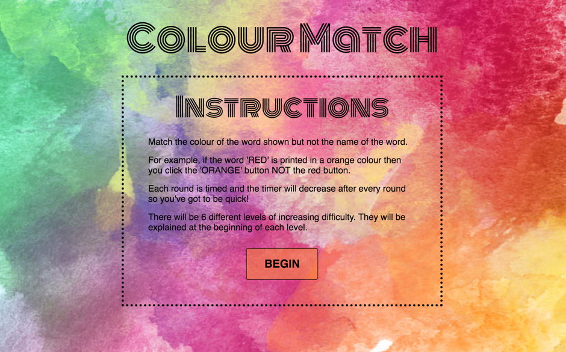
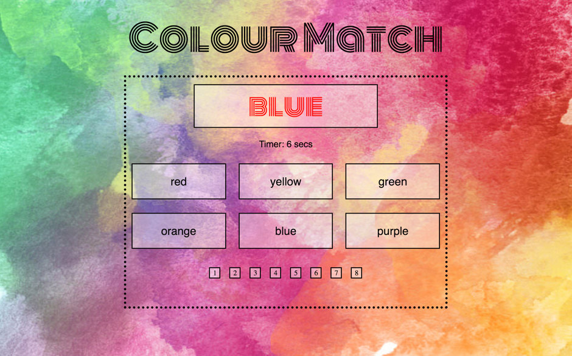
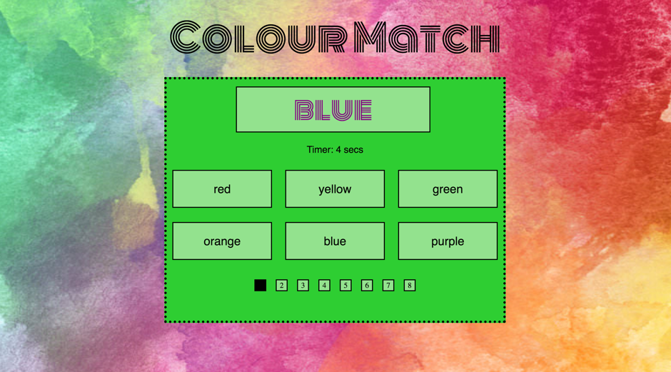
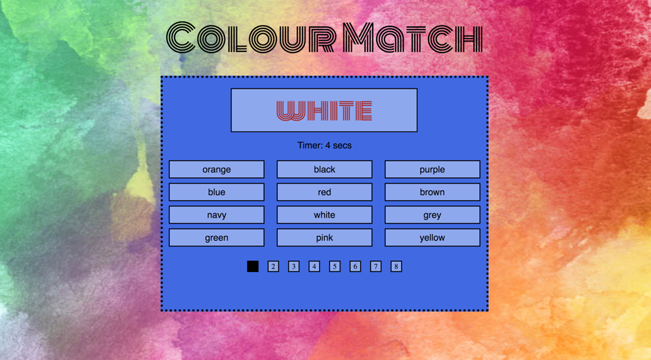
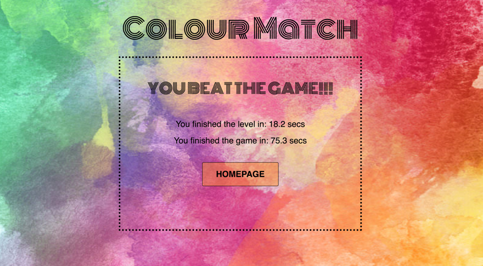

# Colour Match

### Project 1 - GA WDI LONDON

This game is inspired by the effect found in Psychology, called the Stroop effect. It demonstrates that our reaction time is severely reduced when the name of a colour (e.g. 'orange', 'blue', or 'purple') is printed in a different colour. For example , if the word 'RED' is printed in a orange colour then you click the 'ORANGE' button NOT the red button. The time taken to name the colour of the word takes longer and is more prone to errors than when the colour of the ink matches the name of the colour.

#### View Online
- [View on Heroku](http://colour-match-game.herokuapp.com/)
- [View on Github](https://github.com/amadeakimmins/wdi-first-project.git)

#### How Colour Match works

- This is a one player game that has 6 levels all testing the players reaction time and ability to click the correct colour of the word shown and not the name of the word.
- There are 8 rounds. Each round is timed and the timer decreases after every round. You must complete all rounds to move onto the next level.
- You will fail if you run out of time or click on the wrong colour. If you fail you go right back to the beginning.
- After every level the time-taken to complete it is displayed on the screen. There are 6 different levels. If you manage to complete them all the time taken to complete the whole game is also displayed.

#### The Levels

  1. Select the colour that is printed on the colour word given 6 choices.

  
  2. Select the colour that is printed on the colour word given 6 choices. However, this time the colour word will be bouncing around.

  3. Select the colour that is printed on the colour word given 6 choices. However, this time the colour word will be bouncing around and the background will be changing after every round.

    

  4. Select the colour that is printed on the colour word given 6 choices. However, this time the colour word will be bouncing around, the background will be changing after every round and the colour buttons will be shuffled after every round.

  5. Select the colour that is printed on the colour word given 12 choices.

  

  6. The last level is a combination of all of the earlier levels: there are 12 choices, the colour word will be bouncing around, the background will be changing after every round and the colour buttons will be shuffled after every round

  

##### Technologies used to create Colour Match
- HTML5
- CSS3
- JavaScript (ECMAScript 6)
- jQuery
- Animation using animate.css stylesheet
- Google font 'Monoton' and 'Syncopate'
- Git
- GitHub
- Heroku

#### Challenges and Problems

The distinction between the colours is not entirely clear, especially in level 5 and 6. This was a problem because I couldn't use any colour I wanted to make it easier to tell them apart. This is because the colours used to print the word were also used in the CSS to produce the colour on the screen and I needed it to be this way in order to shuffle the buttons.

I found building the levels challenging because, at first, I attempted to use the same div for all the levels and to add classes to change the different features. This, however, became more complicated when trying to build the third level. Instead I built separate divs in my HTML for each level which was successful. However, this meant that there was a lot more code to build the game and so might not be as DRY as it could be.

#### Wins

I really enjoyed building this game and I am really happy with the way it looks and that all the levels are functioning. I built a lot more levels than I was expecting. It was really satisfying when it started working which made up for when I got frustrated trying to make something work.

I am also really pleased with the timer and that it is keeping score of how long each level took at the end as well as the entire time it took to complete the game and showing this on the last page. This makes the game more competitive.

#### Future features

To make the game even more competitive I would like to add the ability to have a leaderboard. I would like to add a feature where the player inputs their name before they start so that at the end their score can be stored to find out who has the highest score.

I would like to try and refactor the code that I have for the levels, if possible, to make it more DRY. For example, finding a way to only have one page for the game and the ability to change the features of the game depending on the leve through the same page. This would make the code in the HTML, CSS and jQuery a lot shorter and more concise.

Add sound effects every time a level is passed or failed and when the whole game is won.
